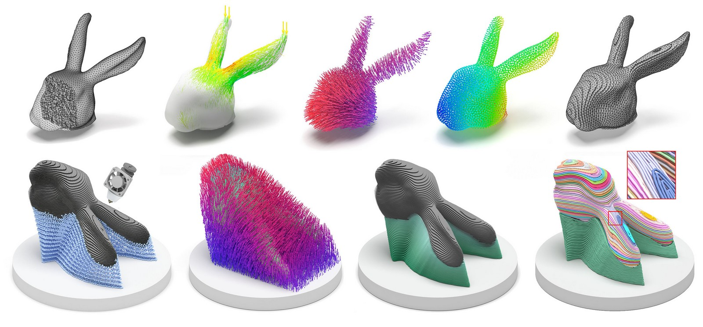

# Reinforced FDM: Multi-Axis Filament Alignment with Controlled Anisotropic Strength

[Guoxin Fang](https://guoxinfang.github.io/),
Tianyu Zhang, Sikai Zhong, Xiangjia Chen, 
[Zichun Zhong](https://zichunzhong.github.io/),
[Charlie C.L. Wang](https://mewangcl.github.io/), 

[*ACM Transactions on Graphics (Proceedings of SIGGRAPH Asia 2020)*, vol.39, no.6, article no.204, 2020.](https://dl.acm.org/doi/abs/10.1145/3414685.3417834)

Updated： July-02-2021

This is the code to slice curved 3D printing layer and generate toolpath based on the stress distribution. The generated toolpath can be printed by multi-axis 3D printer, which results a higher strength in fabricated model.

## Installation

Please compline the code with QMake file 'ReinforcedFDM.pro'.

Tested platform: 

MacOS: QT Creator 

**Windows (recommand)**: Visual Studio + QT-plugin (tested QT version: 5.12.10 + msvc2017_64)

**Remark**: if you are using Visual Studio, after using QT VS Tool to open the .pro file and generate the project,

- **Set 'shapeLab' as the start up project**

- **Enable OpenMP to get best performace** at: ShapeLab Project Property -> 'Configuration Proerties' -> c/c++ -> Language -> Open MP Support -> Select 'Yes (/openmp)'

- **Open Console** at: ShapeLab Project Property -> 'Configuration Proerties' -> Linker -> System -> Select 'Console (/SUBSYSTEM:CONSOLE)' in 'SubSystem'

## Usage

**First input tetrahedral mesh into the system.**

Two sample model is given 'Bunnyhead.tet' and 'topopt_new.tet'. You can either drag the file into the blank area of the UI or open the panel "file -> open".

#Step 1: 

**Input FEA simulation result** and compute principle stress direction as vector field by clicking bottom 'Step 1: Input FEA Result'.

-The color map on the mesh visulize the stress distribution. You can draw the stress vector field by using function "View -> Profile" or direct click the "Profile" bottom.

-You can also change the percentage of the critical region by changing the value below 'Step 1: Input FEA Result' bottom and click 'Change ratio' to redraw the field. Notice the parameter used in our paper is already set as the initial value in UI.

#Step 2: 

**Compute Field** (for both vector field and scalar field) by clicking bottom 'Step 2: Field Computing'. This process may take some time.

-After finish computing the field, you can draw the scalar field at by using function "View -> Node" or direct click the "Node" bottom.

-The vector field can be draw by using function "View -> Profile" or direct click the "Profile" bottom. (the perivious stress field will be replaced).

#Step 3:

** Slicing the model and generate curved layer ** by clicking bottom 'Step 3: Curved Layer Slicer'. You can change the Layer # with different value on the right side.

-You will then have the curved layer in the UI. You can check each layer in "Visual" panel by choosing differnt layer number or only draw single layer by click 'Draw Single'.

#Step 4:

** Compute vector field on each curved surface (for toolpath generation) ** by clicking ' Step 4: Compute Field on Iso-Surface'.

- ** Caution: ** Before run this process, please make sure you disable the drawing of profile, otherwise the system will automatic draw the vector field on every layer (may take 1 min to draw this)!
